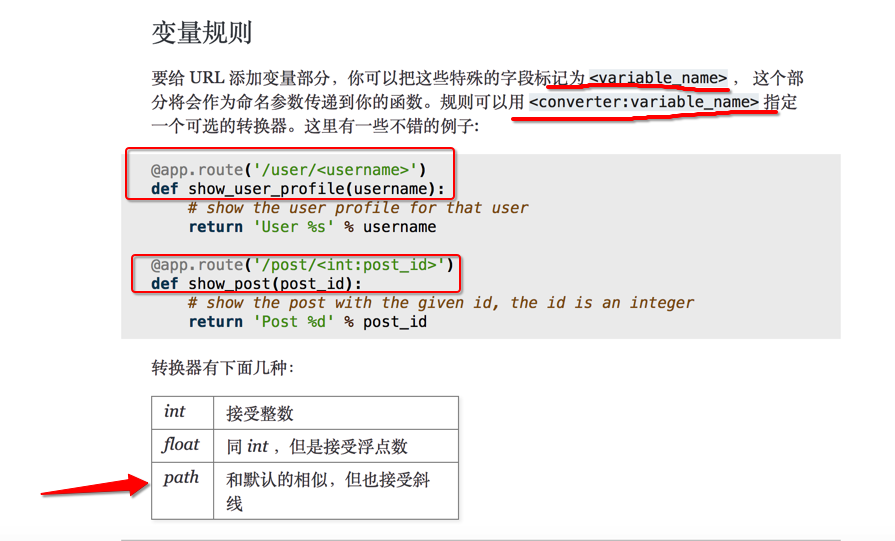

`5.03`
# Flask

day01	
## HTTP通信
- 浏览器到服务器
- 浏览器发出请求报文request
  - 起始行
  - 请求头header
  - 请求体body
- 通过**TCP传输**
- 服务器按照HTTP协议格式进行解析
  - 根据解析后的请求信息,进行**路由分发**
  - 具体业务逻辑,执行相应代码
  - 组织响应数据,打包成HTTP响应报文
- 服务器返回HTTP协议数据
  - 起始行
  - 响应头header
  - 响应体body 

### question
1. 路由分发?
   url的匹配
   
2. WSGI协议?

3. 服务器模型
3. django的功能是框架,自身提供的服务器runserver只是方便调适.在django后期的安排中,使用uwsgi服务器

### 框架

#### 核心
1. 实现路由
2. 视图函数(业务逻辑)
3. flask的核心
   - Werkzeug  实现路由
   - Jinja2  实现模版

#### 框架的轻重
- 重量级:Django
- 轻量级:Flask、Tornada.Webpy


### 迁移所有的虚拟环境,依赖包
- pip freeze > 文件   重定向
- pip install 

- 导入相关的包
- 创建flask的app
  
  ```
  app = Flask(__name__,
              static_url_path="",  #  默认是/static
              template_url_path=""  # 默认是/template)
  
  __name__:模块名,flask会把这个模块所在的目录当作当前flask的工程目录,以此目录为根目录寻找static和template
  
  ```


- Flask中绑定路由

	```
	跟Django不同,没有专门的文件负责url
	而是跟之前学习过的webmini框架类似,使用路由的装饰器
	
	@app.route("/")
	
	```

- 启动服务器
  
  ```
  Flask中也有用于测试的服务器,
  相当于Django中的 python manage.py runserver
  
  app.run()
  ```
  
  
- 为flask添加配置
  
  ```
  1.通过外置文件
  新建文件 MyConfig.cfg
  app.config.from_pyfile("MyConfig.cfg")
  
  
  2.通过对象的方式读取配置参数
  class MyConfig(object):
  		"""配置信息"""
  		DEBUG = True
  		
  3.在程序启动时
  app.run(debug=True)
  
  ```
  
  
- 指定访问的host和port

  1. app.run(host="0.0.0.0", port="")
  2. ip设为0.0.0.0的话,既可以访问本机回环地址127.0.0.1,也可以访问外网地址


- 同一路由装饰多个函数
  - 第一个函数会被运用

- 查看路由映射: url_map


- app.route()的参数
  1. 路由,路径 “/”
  2. 请求方式 method=['GET']

- url反解析
  
  ```
  在Django的url中,如果要使用反向解析,需要自己命名
  url(r'', views.index, name='index')
  
  在flask中,使用反解析,不需要自己命名,函数名就是url的名字,要使用反解析,需要使用flask自带的url_for
  
  url_for(“views‘ name”) ---> urls' address
  
  
  ```
  
- 转换器
  
  

  ```
  # app.route(“/<name>”)
  
  提取出url中的整数
  app.route(“/<int:id>”)  # int --> 过滤条件 id --> 提取出的东西
  def hello(id):
  		return id
  ```
  
  - 当flask自带的路由过滤器不能满足要求时,如“提取出url后的3个整数”
  - 自定义路由转化器
  
  ```
  1.自定义转化器类
  class ReConverter(BaseConverter):
  		"""自定义的支持传入正则表达式的转换器"""
  		
  		def __init__(self, url_map, *args):
  		# 调用父类方法,注意flask使用的是python2,调用父类方法时需要传入名字
  		
  		super(Reconverter, self).__init__(url_map)
  		# 将传入的参数args,保存到regex属性中
  		
  		self.regex = args[0]  # args[0]就是我们在路由装饰器参数中传入的正则表达式
 
 2. 绑定
 app.url_map.converter["re"]=ReConverter
 
 3. 在路由装饰器中使用正则
   #  捕获url中的3个整数
   app.route(“/id/<re('\d{3}'):id>”)
  def hello(id):
  		return id
  
  
  ```
  
#### question
- 路由中的动态参数 
  url_for


`5.05`
### 终止视图函数 abort

- 类似于python中的中止错误的raise,在视图函数中执行,可以捕获不同类型的错误

```

@app.route("/")
def index():
	abort(403)  # abort中的参数是http标准状态码
	return “index page”

```

- 自定义错误处理方法
- 使用`errorhandler`装饰器

  ```
  @app.errorhandler(403)  # 参数为http标准状态码
  def handle_403(e):  # 函数的参数接收的是flask默认的错误信息
  		return 
  ```
  
### 响应报文 make_response

- 视图函数不仅可以返回str,也可以返回一个元组  `(body, status, header)`

- `status`除了http标准状态码,还可以是自定义的数字和str
  1. `return "index", 666`
  1. `return "index", "666 a status code"`
 
- `header` 键值对
  1. 列表  由元组构成
  2. 字典
 
#### 在flask中创建response对象

- flask中提供了自己构造response对象的方法`make_response` 
  1. 创建response对象
  `resp = make_response(body)`
  
  2. 添加状态码
  `resp.status =  "666 a status code"`
  
  

### 返回json格式数据

 - 方法一
   1. 引入json模块
   `import json`
   
   2. 准备数据
   `data = {"name":"haha"}`

   2. 转换数据为json格式并返回
   `return json.dumps(data), {"Content-Type":"application/json"}`
   
 
 - 方法二 使用flask包装好的方法jsonify
   1. 导入
   `from flask import jsonify`
   
   2. 准备数据
    `data = {"name":"haha"}`
   
   3. 转换数据为json格式并返回
   `return jsonify(data)`
   
   
   
### session

#### 设置密钥
- 在flask中使用session要设置secret—_key

1. **在配置文件中(常用)**
   `app.config["SECRET_KEY"]=""`
2. app的secret_key属性
   `app.secret_key = ""`
   
#### 禁止cookie后如何使用session
session_id依赖于cookie,如果用户禁止了cookie,则可以把session_id拼接在url后面.


### 请求上下文和应用上下文
上下文就是一个容器,保存flask运行的信息

#### 请求上下文 request context
request 和 session

#### 应用上下文 application context
current_app 和 g

#### 线程局部变量????
threadlocal

### 请求钩子
- 类似于Django的中间件,以装饰器方式存在

1. `before_first_request`

2. `before_request`

3. `after_request`
4. `teardown_request` 

### 安装manager

1. 安装 flask— script包
2. 导入 manager
3. 托管app
4. manager.run

- 运行项目 跟Django一样
  python demo.py runserver -h -p 
- 开启shell
  python demo.py shell
  
  

### 模版变量 render_template

- 与django的render不同,render_template的参数不是字典,而是一个键值对

`render_template(“demo.html”, name="haha",age=18)`

- 当有多个变量需要传递,定义了一个字典之后,使用render_template()需要**拆包**
- 与django的不同,flask的模版变量可以进行加减乘除

```
context = {
	"name": "haha",
	"age": 18
}

render_template(“demo.html”, **context)

```

#### 传入dict、list
```
my_dict = {"a": 1, "b": 2}
my_list = [3, 4, 5, 6, 10, 11]
my_int = 0

context = {
        "name": "haha",
        "age": 18,
        "my_dict": my_dict,
        "my_list": my_list,
        "my_int": my_int
    }

render_template(“demo.html”, **context)

```


#### template接收模版变量
- 与Django模版中接收模版变量类似
`{{ name }}`
`{{ my_dict[“a”] }}` == `{{ my_dict.a }}`

#### 过滤器
在模版中接收变量时使用过滤器

`{{ " hahaha   " | trim | upper }}`

- 字符串
- 列表
- 链式

- 与python中对字符串的操作类似
trim: 去掉值的首位空格
first: 取出第一个元素
sum: 计算纵隔


#### 自定义过滤器
- 方法一
	1. 自定义过滤器,定义过滤器函数
	
	   ```
	   def 
	   ```
	
	2. 添加到app的过滤器集合中
	   `app.add_template_filter(视图函数名, “过滤器名字”)`
 
 - 方法二
     使用template_filter装饰器
     
     ```
     @app.template_filter("li_3")
def filter_2_list(li):
    """自定义一个过滤器，将模版变量中的列表隔两位提取出来"""
    return li[::3]
     ```


### 表单

#### 自定义表单类
- 在flask中,可以定义表单的类,要继承FlaskForm类
- 与django中的模型类相似 ORM 生成对应的表

```
from flask import Flask, request, render_template
from flask_wtf import FlaskForm
from wtforms import StringField, PasswordField, SubmitField
from wtforms.validators import DataRequired, EqualTo

app = Flask(__name__)

# 表单中的csrf_token需要secret_key
app.config["SECRET_KEY"] = "nig89tgj32ojo"

# flask中的表单类，与Django中的模型类相似


# 表单类要继承FlaskForm
class RegisterForm(FlaskForm):
    """注册表单类，表单中的字段自定义"""

    # 字段的参数接收限制条件，是一个列表
    name = StringField(label="name", validators=[DataRequired()])
    password = PasswordField(label=u"密码", validators=[DataRequired()])
    passwd2 = PasswordField(label=u"再次输入密码", validators=[EqualTo("password")])
    sub = SubmitField(label=u"提交")
	
```

#### 表单的验证
1. 在视图函数中创建表单对象`form = `
   
2. 验证表单`validate_on_submit()`
   - 如果数据符合自定义表单中的验证器,则返回True;否则返回False
   
#### csrf_token
1. 在模版中添加`{{ form.csrf_token }}`,才能顺利发送表单

2. 生成csrf_token需要**密钥**
   
